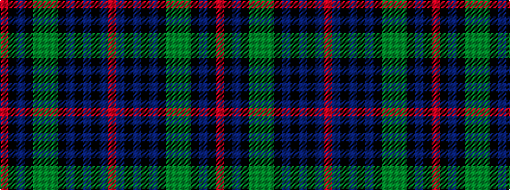

RBKBKBKGGGKBKR

It is a 14 stripe tartan.

<figure class="pat-woven">

<figcaption>idealised sample</figcaption>
</figure>

## Colour Sequence



## Tartans with this colour sequence

This pattern is a design lineage: every tartan below shares one colour order, whatever its owner —
near-identical designs are grouped, the largest lineage first (#112: the pattern is a tartan's
second parent, beside its family or clan).

<table class="sett-table">
<tbody>
<tr><td><a href="/setts/r2db4k1db1k1db1k8g8y2g8k8db8k1r2/">Farquharson</a></td></tr>
<tr><td class="sett-swatch"></td></tr>
<tr><td><a href="/variants/s14/r2k1db8k8g8y2g8k8db1k1db1k1db4r1~x4/">Farquharson</a></td></tr>
<tr><td class="sett-swatch"></td></tr>
<tr><td><a href="/variants/s14/r8db30k4db4k4db4k56g55y8g55k56db46k4r8/">Farquharson (Clan)</a></td></tr>
<tr><td class="sett-swatch"></td></tr>
</tbody>
</table>

