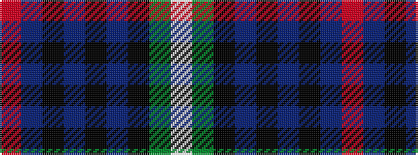

RBKBKBKGW

It is a 9 stripe tartan.

<figure class="pat-woven">

<figcaption>idealised sample</figcaption>
</figure>

## Colour Sequence



## Tartans with this colour sequence

| Tartans |
|---------------|
| [Semple](/setts/s9/r4db11k3db3k3db4k15g36w3~x2/)|
||
| [Semple (Name)](/setts/s9/r4b11k3b3k3b4k15g36w3~x2/)|
||
