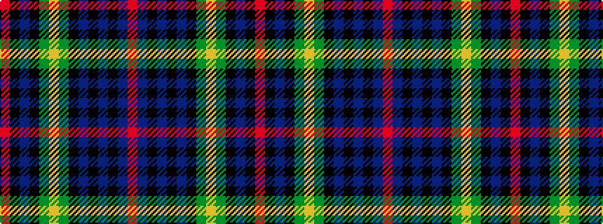

RBKBKBKGYGKBKR

It is a 14 stripe tartan.

<figure class="pat-woven">

<figcaption>idealised sample</figcaption>
</figure>

## Colour Sequence



## Tartans with this colour sequence

| Tartans |
|---------------|
| [Farquharson](/setts/s14/r2k1db8k8g8ly2g8k8db1k1db1k1db4r1~x4/)|
||
| [Farquharson](/tartans/r2db4k1db1k1db1k8dg8ly2dg8k8db8k1r2/)|
||
| [Farquharson](/setts/s14/r2db4k1db1k1db1k8g8ly2g8k8db8k1r2~x2/)|
||
| [Farquharson (Clan)](/setts/s14/r8b30k4b4k4b4k56g55ly8g55k56b46k4r8/)|
||
