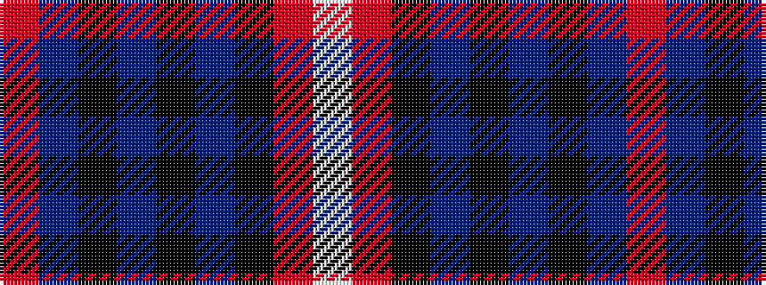

RBKBKBKRW

It is a 9 stripe tartan.

<figure class="pat-woven">

<figcaption>idealised sample</figcaption>
</figure>

## Colour Sequence



## Tartans with this colour sequence

| Tartans |
|---------------|
| [Doune (District)](/setts/s9/o10t11k2t3k2t2k8o40w4~x2/)|
||
