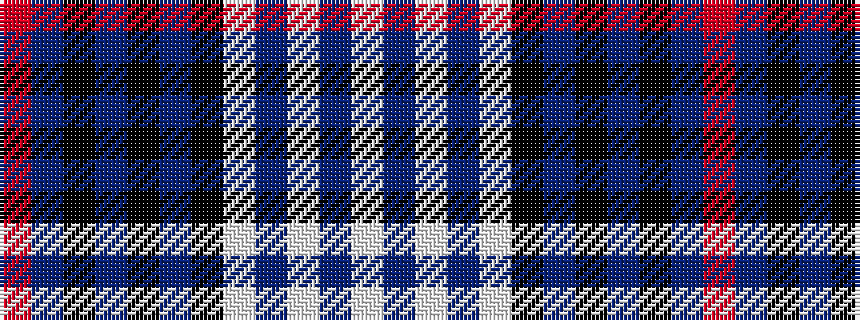

RBKBKBKWBWBW

It is a 12 stripe tartan.

<figure class="pat-woven">

<figcaption>idealised sample</figcaption>
</figure>

## Colour Sequence



## Tartans with this colour sequence

| Tartans |
|---------------|
| [Unidentified (Fashion)](/setts/s12/w5t2w2t3w17k6n2k2n2k2n14r3~x2/)|
||
