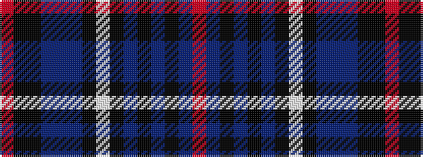

RBKBKBKWKBBBKKR

It is a 15 stripe tartan.

<figure class="pat-woven">

<figcaption>idealised sample</figcaption>
</figure>

## Colour Sequence



## Tartans with this colour sequence

| Tartans |
|---------------|
| [The Trew 40th](/setts/s15/r4k3k11dt3db3dt30k1w4k1dt3k3dt3k3dt12r2~x2/)|
||
