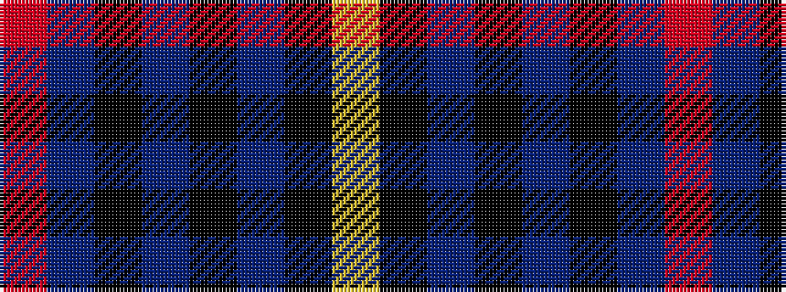

RBKBKBKY

It is a 8 stripe tartan.

<figure class="pat-woven">

<figcaption>idealised sample</figcaption>
</figure>

## Colour Sequence



## Tartans with this colour sequence

| Tartans |
|---------------|
| [Highland Autumn (Fashion)](/variants/s8/r2n2k2n28k8n9k1lo2~x2/)|
||
