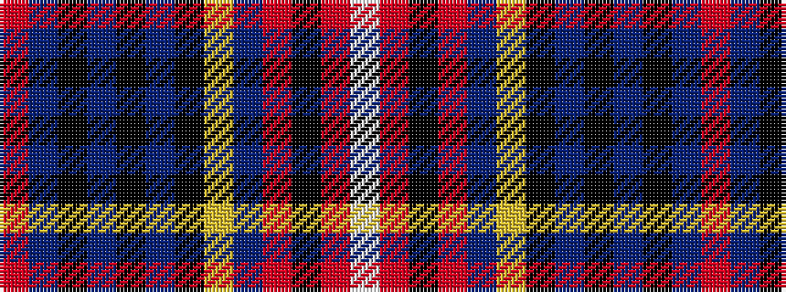

RBKBKBKYBRKRW

It is a 13 stripe tartan.

<figure class="pat-woven">

<figcaption>idealised sample</figcaption>
</figure>

## Colour Sequence



## Tartans with this colour sequence

| Tartans |
|---------------|
| [Alberta Caledonia (Corporate)](/setts/s13/r6db9k2db2k2db9k10ly4n17r5k2r5w4~x2/)|
||
