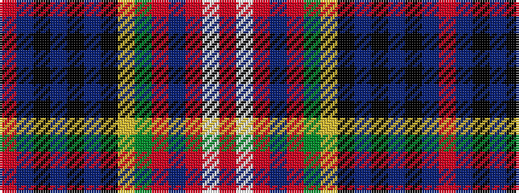

RBKBKBKYGRBRWR

It is a 14 stripe tartan.

<figure class="pat-woven">

<figcaption>idealised sample</figcaption>
</figure>

## Colour Sequence



## Tartans with this colour sequence

| Tartans |
|---------------|
| [Caledonia Variant](/variants/s14/r7t3k2t2k2t3k6ly2dg7r4db2r4w2r5~x2/)|
||
| [Caledonia, Variant](/variants/s14/r7t3k2t2k2t3k6ly2g7r4db2r4w2r5~x2/)|
||
