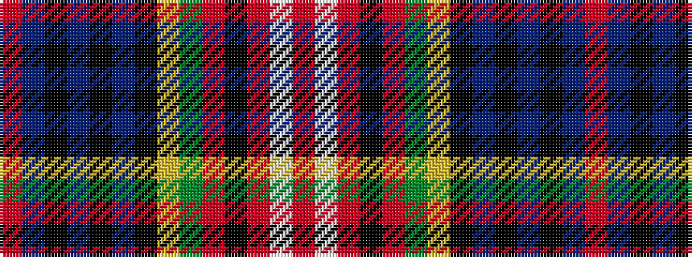

RBKBKBKYGRKRWR

It is a 14 stripe tartan.

<figure class="pat-woven">

<figcaption>idealised sample</figcaption>
</figure>

## Colour Sequence



## Tartans with this colour sequence

| Tartans |
|---------------|
| [Caledonia](/variants/s14/r21t9k2t2k2t9k18ly3g21r13k3r13w2r13~x2/)|
||
| [Caledonia - 1819 (Wilsons') No.155](/variants/s14/r9t8k2t2k2t8k16ly3dg18r10k3r10w2r5~x2/)|
||
