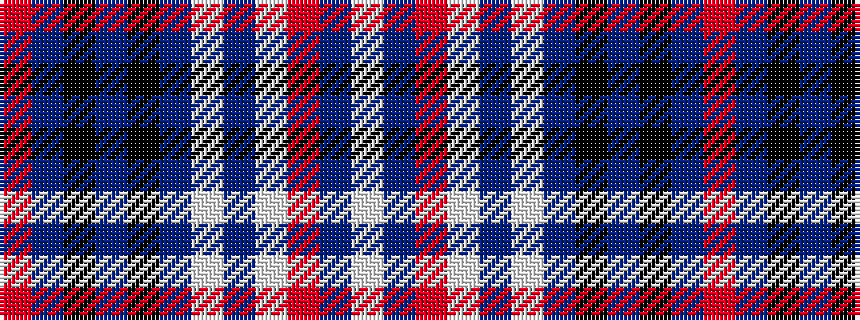

RBKBKBWBWRBW

It is a 12 stripe tartan.

<figure class="pat-woven">

<figcaption>idealised sample</figcaption>
</figure>

## Colour Sequence



## Tartans with this colour sequence

| Tartans |
|---------------|
| [North Carolina State University](/setts/s12/w15n25r10w5n25w7n16k9n17k10n23r9/)|
||
| [North Carolina State University - Pack Plaid](/setts/s12/w15dt25r10w5dt25w7dt16k9dt17k10dt23r9~x2/)|
||
