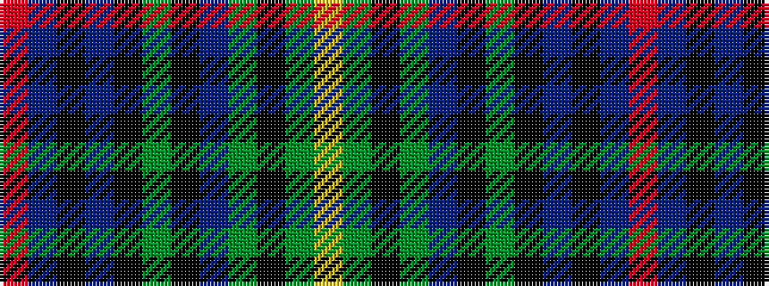

RBKBKGKBGKGY

It is a 12 stripe tartan.

<figure class="pat-woven">

<figcaption>idealised sample</figcaption>
</figure>

## Colour Sequence



## Tartans with this colour sequence

| Tartans |
|---------------|
| [van der Watt Personal)](/setts/s12/r1db6k1db1k8g1k8dp2g1k1g6lo1~x4/)|
||
