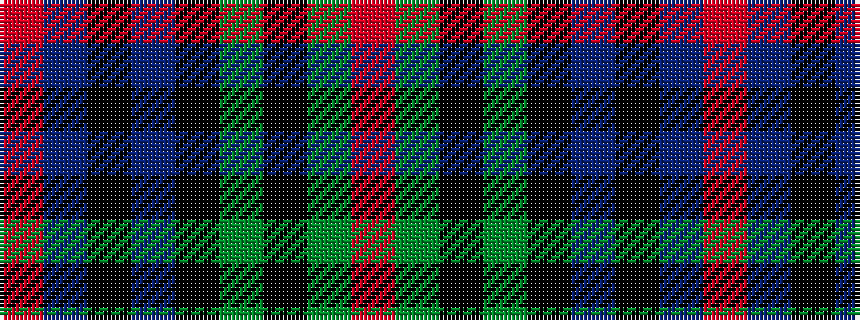

RBKBKGKGR

It is a 9 stripe tartan.

<figure class="pat-woven">

<figcaption>idealised sample</figcaption>
</figure>

## Colour Sequence



## Tartans with this colour sequence

| Tartans |
|---------------|
| [Ayrton](/setts/s9/r3dg2k1dg20k9t20k1t2r3~x2/)|
||
| [Ayrton](/setts/s9/r3g2k1g20k9t20k1t2r3~x2/)|
||
