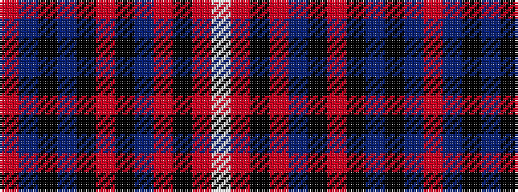

RBKBKRKBRKRW

It is a 12 stripe tartan.

<figure class="pat-woven">

<figcaption>idealised sample</figcaption>
</figure>

## Colour Sequence



## Tartans with this colour sequence

| Tartans |
|---------------|
| [Wcwm 9275-1405](/variants/s12/o48dp3k8ni2k2o2k2n10o6k2o3lb2~x2/)|
||
