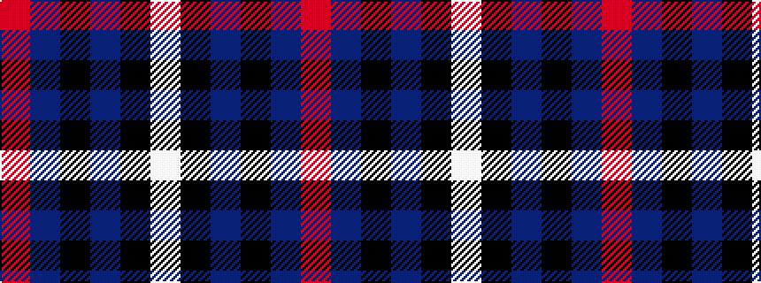

RBKBKW

It is a 6 stripe tartan.

<figure class="pat-woven">

<figcaption>idealised sample</figcaption>
</figure>

## Colour Sequence



## Tartans with this colour sequence

| Tartans |
|---------------|
| [Sorbie (Name)](/variants/s6/r1b1k17b17k1w1~x4/)|
||
