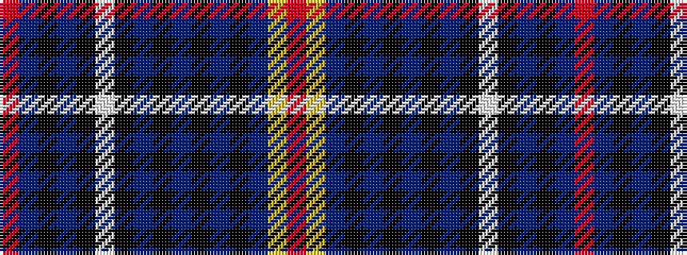

RBKBKWKBKBKBKBYR

It is a 16 stripe tartan.

<figure class="pat-woven">

<figcaption>idealised sample</figcaption>
</figure>

## Colour Sequence



## Tartans with this colour sequence

| Tartans |
|---------------|
| [Royal Scottish Country Dance Society](/setts/s16/r3dt14k12t24k1w3k1t24k12dt2k2dt2k2dt8ly1r3~x2/)|
||
