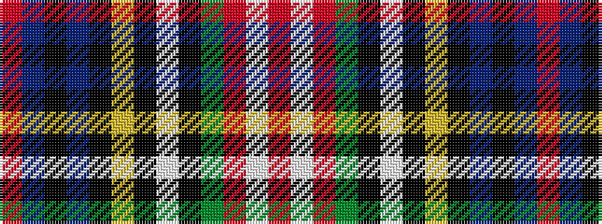

RBKBKYKWKGRWR

It is a 13 stripe tartan.

<figure class="pat-woven">

<figcaption>idealised sample</figcaption>
</figure>

## Colour Sequence



## Tartans with this colour sequence

| Tartans |
|---------------|
| [Christie](/variants/s13/r6db2k2db4k4ly2k1w2k1dg9r6w2r6~x4/)|
||
| [Christie](/variants/s13/r8db2k1db3k4ly1k1w1k1g8r6w1r6~x4/)|
||
