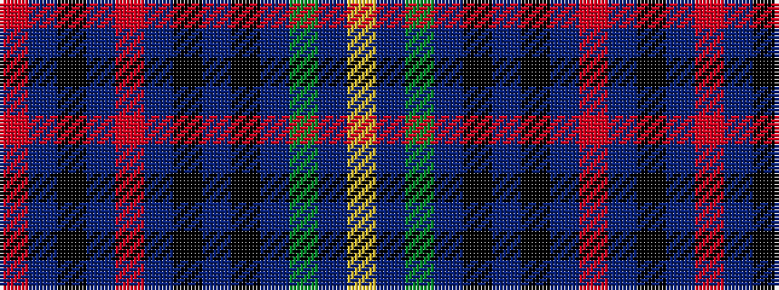

RBKBRBKBKBGBY

It is a 13 stripe tartan.

<figure class="pat-woven">

<figcaption>idealised sample</figcaption>
</figure>

## Colour Sequence



## Tartans with this colour sequence

| Tartans |
|---------------|
| [Bruma](/setts/s13/r2do1k1do10r1do10k13n4k1n11dy9n2lr1~x2/)|
||
