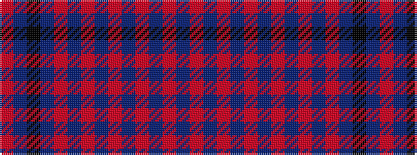

RBKBRBRBRBRBRBR

It is a 15 stripe tartan.

<figure class="pat-woven">

<figcaption>idealised sample</figcaption>
</figure>

## Colour Sequence



## Tartans with this colour sequence

| Tartans |
|---------------|
| [Ettrick (Fashion)](/setts/s15/o4n12k12n4oi18n1o1n1oi2n1o2n1oi4n1o4~x4/)|
||
