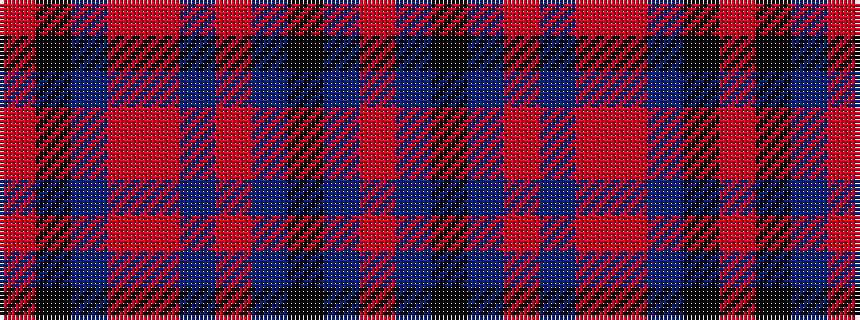

RBKBRBRRBKR

It is a 11 stripe tartan.

<figure class="pat-woven">

<figcaption>idealised sample</figcaption>
</figure>

## Colour Sequence



## Tartans with this colour sequence

| Tartans |
|---------------|
| [Brodie, Graeme (Personal)](/setts/s11/o2do2k37do3r2do3r1r4do4k19r1~x2/)|
||
