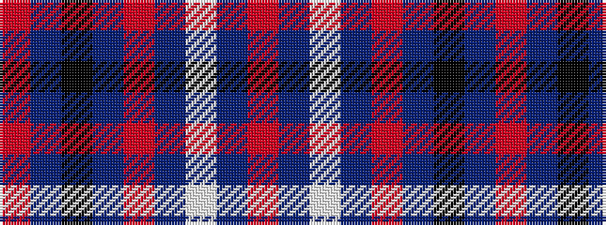

RBKBRBWBR

It is a 9 stripe tartan.

<figure class="pat-woven">

<figcaption>idealised sample</figcaption>
</figure>

## Colour Sequence



## Tartans with this colour sequence

| Tartans |
|---------------|
| [MacPherson #4](/variants/s9/r1t1k11t1r1t1w11t1r1~x2/)|
||
