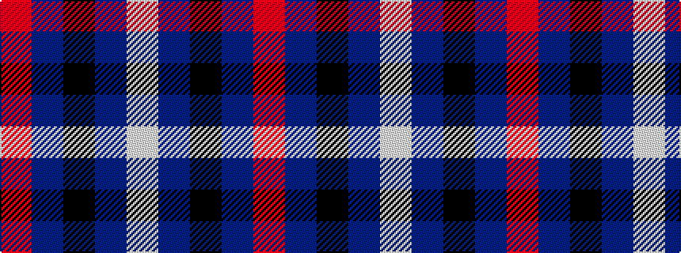

RBKBW

It is a 5 stripe tartan.

<figure class="pat-woven">

<figcaption>idealised sample</figcaption>
</figure>

## Colour Sequence



## Tartans with this colour sequence

| Tartans |
|---------------|
| [Davidson of Tulloch](/variants/s5/r6dbi35k36db36w6/)|
||
| [Davidson of Tulloch Clan Tartan](/variants/s5/r6db35k36db36w6/)|
||
| [RSCDS Australia? (Corporate)](/variants/s5/r2db12k5t16w2~x4/)|
||
