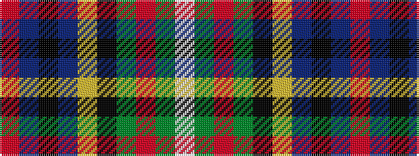

RBKBYKGRGW

It is a 10 stripe tartan.

<figure class="pat-woven">

<figcaption>idealised sample</figcaption>
</figure>

## Colour Sequence



## Tartans with this colour sequence

| Tartans |
|---------------|
| [Loch Freuchie (District)](/setts/s10/r3dt3k2dt18ly2k25g20r2g3lb3~x2/)|
||
