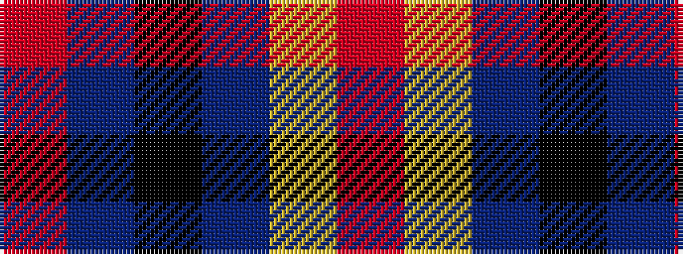

RBKBYR

It is a 6 stripe tartan.

<figure class="pat-woven">

<figcaption>idealised sample</figcaption>
</figure>

## Colour Sequence



## Tartans with this colour sequence

| Tartans |
|---------------|
| [University of Notre Dame](/variants/s6/r5db35k25db8ly10r5~x2/)|
||
