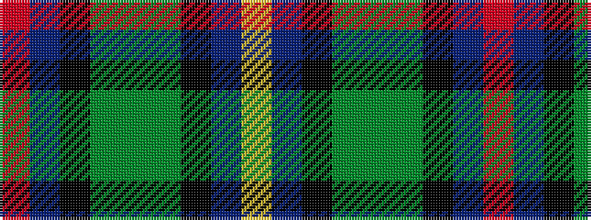

RBKGGGKBY

It is a 9 stripe tartan.

<figure class="pat-woven">

<figcaption>idealised sample</figcaption>
</figure>

## Colour Sequence



## Tartans with this colour sequence

| Tartans |
|---------------|
| [Quinn](/setts/s9/r1n8k4g1g4g1k4n8ly1~x6/)|
||
| [Quinn (Personal)](/setts/s9/r1b8k4g1dg4g1k4b8ly1~x6/)|
||
