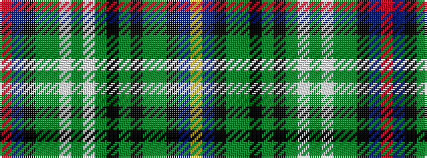

RBKGGWGWGKGKGGKBY

It is a 17 stripe tartan.

<figure class="pat-woven">

<figcaption>idealised sample</figcaption>
</figure>

## Colour Sequence



## Tartans with this colour sequence

| Tartans |
|---------------|
| [Service, of Drymen](/variants/s17/r2db14k2y5g3w1g3w1g3k1g3k1g3y5k2db14ly2~x2/)|
||
