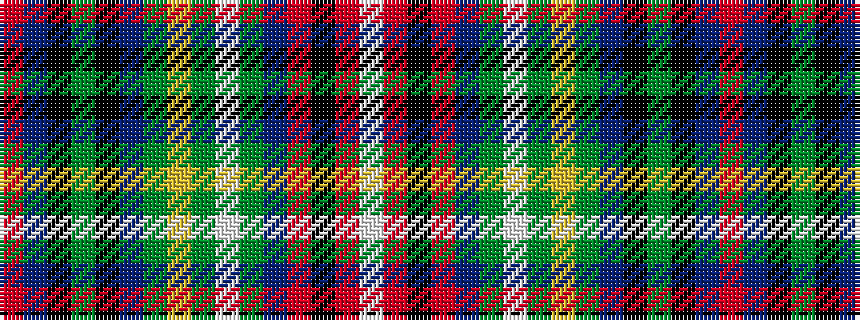

RBKGKBGYGWGBRKRW

It is a 16 stripe tartan.

<figure class="pat-woven">

<figcaption>idealised sample</figcaption>
</figure>

## Colour Sequence



## Tartans with this colour sequence

| Tartans |
|---------------|
| [Hueg (Bavaria) Scottish Thistle (Personal)](/variants/s16/r2dp2k3dg25k2dp3dg4lo2dg2w2dg6dp2r7k2r3w2~x2/)|
||
| [Hueg Scottish Thistle (Personal)](/variants/s16/r2dt2k3dg25k2dt3dg4ly2dg2w2dg6dt2r7k2r3w2~x2/)|
||
