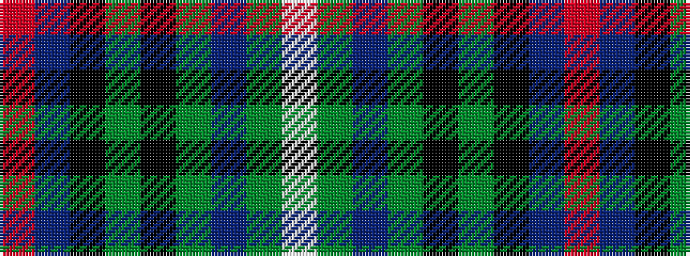

RBKGKGBGW

It is a 9 stripe tartan.

<figure class="pat-woven">

<figcaption>idealised sample</figcaption>
</figure>

## Colour Sequence



## Tartans with this colour sequence

| Tartans |
|---------------|
| [Scottish Ambulance Service (Corporat](/setts/s9/r3ti16k12g2k2dg32t2dg2lb3~x2/)|
||
