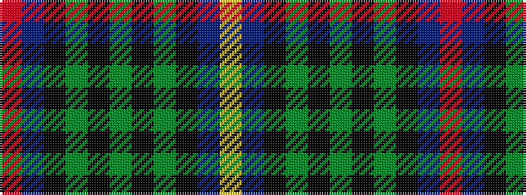

RBKGKGKGKBY

It is a 11 stripe tartan.

<figure class="pat-woven">

<figcaption>idealised sample</figcaption>
</figure>

## Colour Sequence



## Tartans with this colour sequence

| Tartans |
|---------------|
| [MacCainsh](/setts/s11/r2db8k1g2k1g4k1g2k1db8lo2~x2/)|
||
| [MacCainsh](/setts/s11/r2db8k1g2k1g4k1g2k1db8ly2~x2/)|
||
