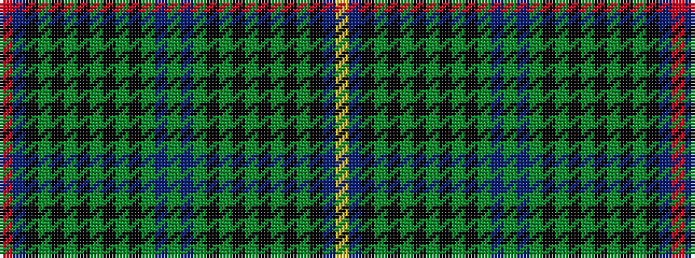

RBKGKGKGKGKGBGBGKGKGKGKGKBY

It is a 27 stripe tartan.

<figure class="pat-woven">

<figcaption>idealised sample</figcaption>
</figure>

## Colour Sequence



## Tartans with this colour sequence

| Tartans |
|---------------|
| [Duchess of Albany](/variants/s27/r2db14k8g2k1g2k1g4k1g2k1g2db4g2db4g2k1g2k1g4k1g2k1g2k8db14ly2~x2/)|
||
| [Duchess of Albany](/variants/s27/r2db24k16g3k2g2k2g12k2g2k2g3db8g2db8g3k2g2k2g12k2g2k2g3k16db22lo2~x2/)|
||
