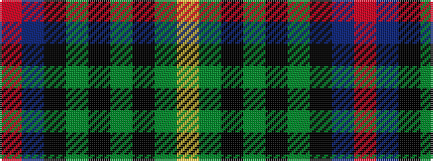

RBKGKGKGY

It is a 9 stripe tartan.

<figure class="pat-woven">

<figcaption>idealised sample</figcaption>
</figure>

## Colour Sequence



## Tartans with this colour sequence

| Tartans |
|---------------|
| [MacDonnald of ye Ylis](/tartans/lr4dg30k1dg1k1dg3k12db10r3/)|
||
| [Sarafilovic (Corporate)](/setts/s9/r4db15k18g3k2g2k2g44ly4~x2/)|
||
