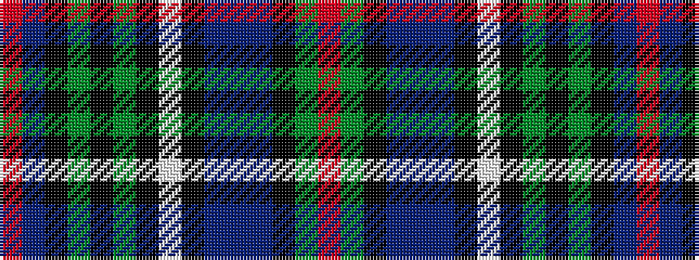

RBKGKGKWKBBBKGR

It is a 15 stripe tartan.

<figure class="pat-woven">

<figcaption>idealised sample</figcaption>
</figure>

## Colour Sequence



## Tartans with this colour sequence

| Tartans |
|---------------|
| [Trew 40th (Personal)](/setts/s15/r4dg3k11do3db3do30k1w4k1dg3k3dg3k3do12r2~x2/)|
||
