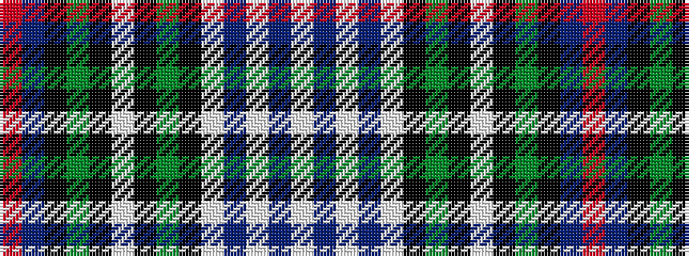

RBKGKWKGKWBWBW

It is a 14 stripe tartan.

<figure class="pat-woven">

<figcaption>idealised sample</figcaption>
</figure>

## Colour Sequence



## Tartans with this colour sequence

| Tartans |
|---------------|
| [Land's End (Unnamed Maroon) (Personal)](/variants/s14/w3t2w7t2w2k7dg8k1w2k1dg8k7db7r2~x2/)|
||
| [MacKenzie Dress](/variants/s14/w3t2w7t2w2k7g8k1w2k1g8k7db7r2~x2/)|
||
