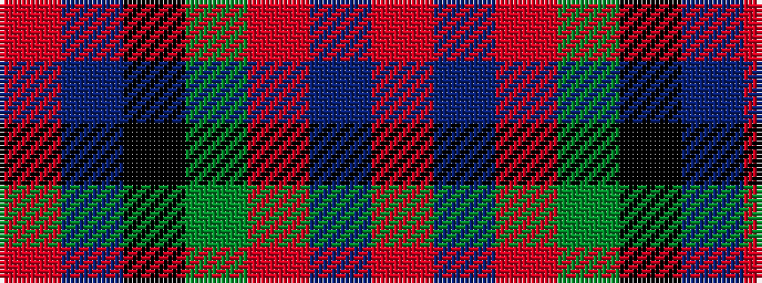

RBKGRBR

It is a 7 stripe tartan.

<figure class="pat-woven">

<figcaption>idealised sample</figcaption>
</figure>

## Colour Sequence



## Tartans with this colour sequence

| Tartans |
|---------------|
| [MacDuff](/setts/s7/r22t8k9g14r10t2r10~x2/)|
||
| [MacDuff #2](/setts/s7/r22t8k9dg14r10t2r10~x2/)|
||
