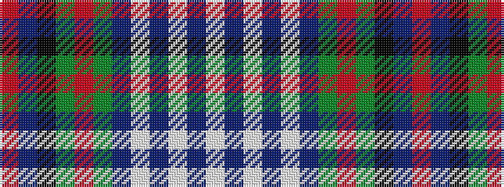

RBKGRGBWBWBW

It is a 12 stripe tartan.

<figure class="pat-woven">

<figcaption>idealised sample</figcaption>
</figure>

## Colour Sequence



## Tartans with this colour sequence

| Tartans |
|---------------|
| [Murray, dress White](/variants/s12/w5db2w17db5w5db9g12r3g12k9db11r3~x2/)|
||
