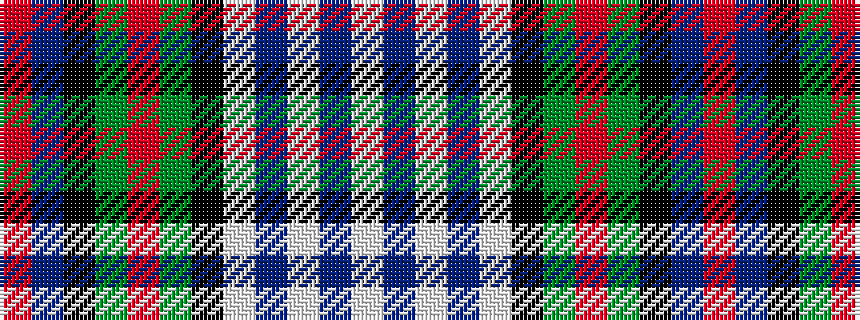

RBKGRGKWBWBW

It is a 12 stripe tartan.

<figure class="pat-woven">

<figcaption>idealised sample</figcaption>
</figure>

## Colour Sequence



## Tartans with this colour sequence

| Tartans |
|---------------|
| [Murray of Atholl Dress](/setts/s12/w5db1w16db4w4k6g10r2g10k6db10r2~x2/)|
||
