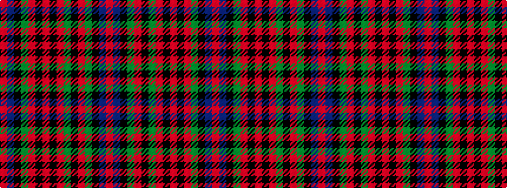

RBKGRKGRKRKRGKBR

It is a 16 stripe tartan.

<figure class="pat-woven">

<figcaption>idealised sample</figcaption>
</figure>

## Colour Sequence



## Tartans with this colour sequence

| Tartans |
|---------------|
| [MacDuff](/variants/s16/r16t6k8g13r7k8g13r7k2r7k2r7g13k8t6r8~x4/)|
||
