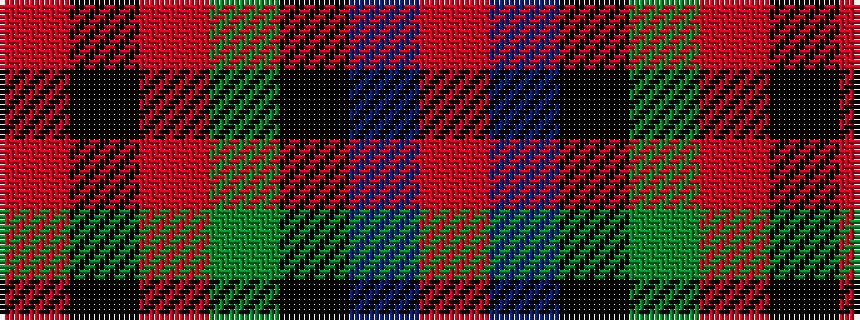

RBKGRKR

It is a 7 stripe tartan.

<figure class="pat-woven">

<figcaption>idealised sample</figcaption>
</figure>

## Colour Sequence



## Tartans with this colour sequence

| Tartans |
|---------------|
| [MacDuff](/variants/s7/r8db3k4dg6r4k1r4~x2/)|
||
| [MacDuff](/variants/s7/r8t3k4g6r4k1r4~x2/)|
||
| [MacDuff #5](/variants/s7/r8t3k4dg6r4k1r4~x2/)|
||
| [MacDuff - 1819 (Clan)](/variants/s7/r36db9k12g17r10k3r10~x2/)|
||
| [MacDuff Clan Tartan](/variants/s7/r8db3k4g6r4k1r4~x4/)|
||
