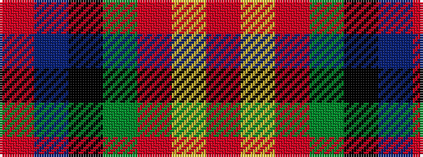

RBKGRYR

It is a 7 stripe tartan.

<figure class="pat-woven">

<figcaption>idealised sample</figcaption>
</figure>

## Colour Sequence



## Tartans with this colour sequence

| Tartans |
|---------------|
| [Sturrock](/variants/s7/r52db16k16g22r16ly3r16/)|
||
| [Sturrock, Blue/Black (Clan)](/variants/s7/r52b16k16g22r16lo3r16~x2/)|
||
