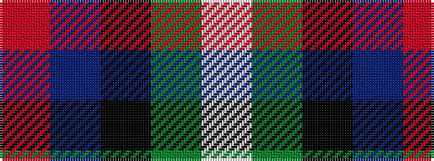

RBKGW

It is a 5 stripe tartan.

<figure class="pat-woven">

<figcaption>idealised sample</figcaption>
</figure>

## Colour Sequence



## Tartans with this colour sequence

| Tartans |
|---------------|
| [Davidson](/setts/s5/r1db6k3g6w1~x4/)|
||
| [Davidson of Tulloch](/setts/s5/r2db10k5g12w2~x2/)|
||
| [Davidson of Tulloch](/setts/s5/r1db6k3dg6lb1/)|
||
| [Davidson of Tulloch #2](/setts/s5/r1db6k3dg6w1~x4/)|
||
| [Davidson of Tulloch (Clan)](/setts/s5/r1db7k7g7w1~x6/)|
||
