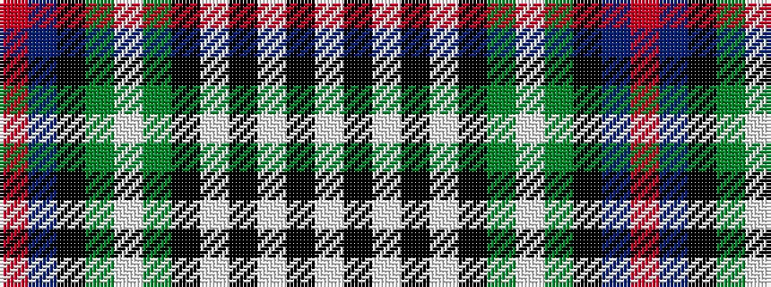

RBKGWGKWKWKW

It is a 12 stripe tartan.

<figure class="pat-woven">

<figcaption>idealised sample</figcaption>
</figure>

## Colour Sequence



## Tartans with this colour sequence

| Tartans |
|---------------|
| [Davidson of Tulloch Dress](/setts/s12/r2db5k5dg5lb2dg5k5lb2k2lb4k2lb2~x2/)|
||
