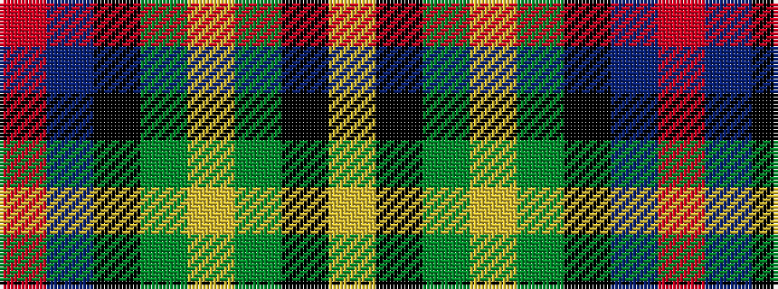

RBKGYGKY

It is a 8 stripe tartan.

<figure class="pat-woven">

<figcaption>idealised sample</figcaption>
</figure>

## Colour Sequence



## Tartans with this colour sequence

| Tartans |
|---------------|
| [Scout Mapping Service #2 (Corporate)](/setts/s8/r2db11k8g8ly2g8k1ly2~x2/)|
||
