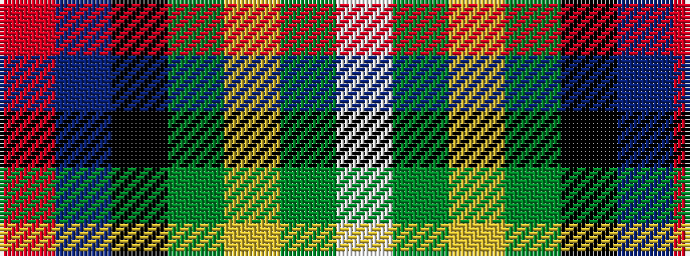

RBKGYGW

It is a 7 stripe tartan.

<figure class="pat-woven">

<figcaption>idealised sample</figcaption>
</figure>

## Colour Sequence



## Tartans with this colour sequence

| Tartans |
|---------------|
| [Hewitt](/variants/s7/r30db12k6dg12ly2dg3w2~x2/)|
||
| [Hewitt (Name)](/variants/s7/r30db12k3g12ly2g3w2~x2/)|
||
