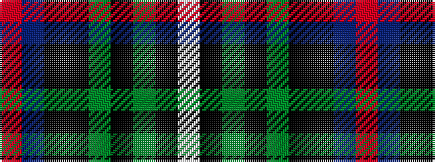

RBKKGKGKW

It is a 9 stripe tartan.

<figure class="pat-woven">

<figcaption>idealised sample</figcaption>
</figure>

## Colour Sequence



## Tartans with this colour sequence

| Tartans |
|---------------|
| [Thistle of Scotland](/setts/s9/m3db24k16ki3g2ki2g2ki28lb3~x2/)|
||
