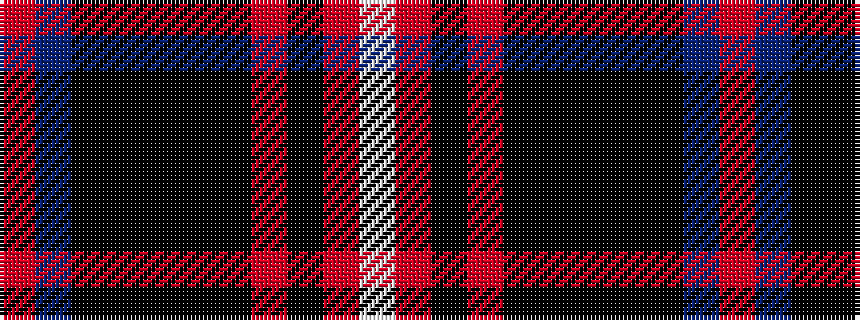

RBKKKKKRKRW

It is a 11 stripe tartan.

<figure class="pat-woven">

<figcaption>idealised sample</figcaption>
</figure>

## Colour Sequence



## Tartans with this colour sequence

| Tartans |
|---------------|
| [Hilton Champion Corporate Golf Tartan Tartan Number: 2336. Earliest known date: c.1970 Originally called Hilton Champion, this tartan was designed by Kinloch Anderson for the officials and winning jacket for the Hilton-sponsored Heritage Classic golf tournament. The name was changed to Heritage Plaid in September 2000 See products available Copyright © Blair Urquhart, Comrie, 2015](/setts/s11/r44t3ki6k2ki2k2ki10r5ki2r3w2~x2/)|
||
