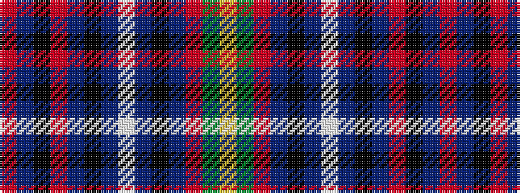

RBKRBKBWBKBRGY

It is a 14 stripe tartan.

<figure class="pat-woven">

<figcaption>idealised sample</figcaption>
</figure>

## Colour Sequence



## Tartans with this colour sequence

| Tartans |
|---------------|
| [MacLellan, McLellan hunting](/variants/s14/r2db7k5r2db5k1db5w1db5k1db5r2g7ly2~x2/)|
||
