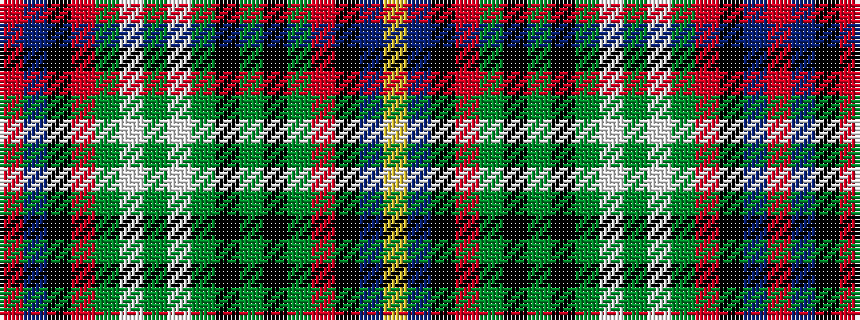

RBKRGWGWGKGKGRKBY

It is a 17 stripe tartan.

<figure class="pat-woven">

<figcaption>idealised sample</figcaption>
</figure>

## Colour Sequence



## Tartans with this colour sequence

| Tartans |
|---------------|
| [Service of Drymen (Personal)](/variants/s17/r2db14k2o5g3lb1g3lb1g3k1g3k1g3o5k2db14lo2~x2/)|
||
| [Service of Drymen Corporate Tartan](/variants/s17/r2db14k2o5g3w1g3w1g3k1g3k1g3o5k2db14ly2~x2/)|
||
