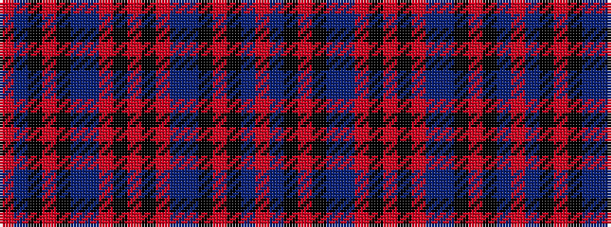

RBKRKBBRKRKRBBKRKBR

It is a 19 stripe tartan.

<figure class="pat-woven">

<figcaption>idealised sample</figcaption>
</figure>

## Colour Sequence



## Tartans with this colour sequence

| Tartans |
|---------------|
| [Taggart](/variants/s19/r4dt5k1r2k1dt6db5r2k4r2k2r2db4t35k1r2k1t4r3~x2/)|
||
