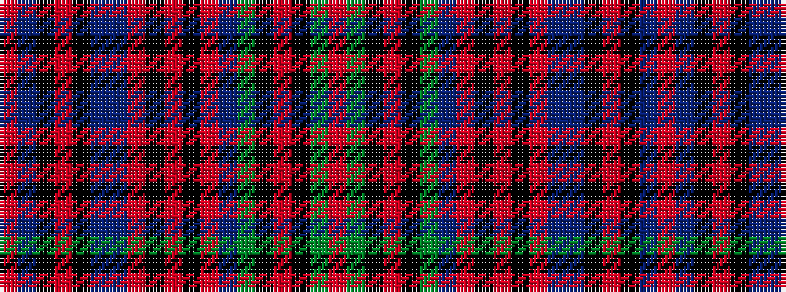

RBKRKBBRKRKRBGKRKGR

It is a 19 stripe tartan.

<figure class="pat-woven">

<figcaption>idealised sample</figcaption>
</figure>

## Colour Sequence



## Tartans with this colour sequence

| Tartans |
|---------------|
| [Taggart (Name)](/variants/s19/r4dg5k1r2k1dg6db5r2k4r2k2r2db4n35k1r2k1n4r3~x2/)|
||
