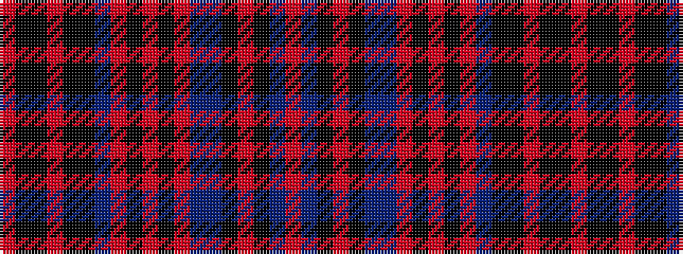

RBKRKBBRKRKRBKKRKKR

It is a 19 stripe tartan.

<figure class="pat-woven">

<figcaption>idealised sample</figcaption>
</figure>

## Colour Sequence



## Tartans with this colour sequence

| Tartans |
|---------------|
| [Taggart Name Tartan](/variants/s19/r4k5ki1r2ki1k6db5r2ki4r2ki2r2db4t35ki1r2ki1t4r3~x2/)|
||
